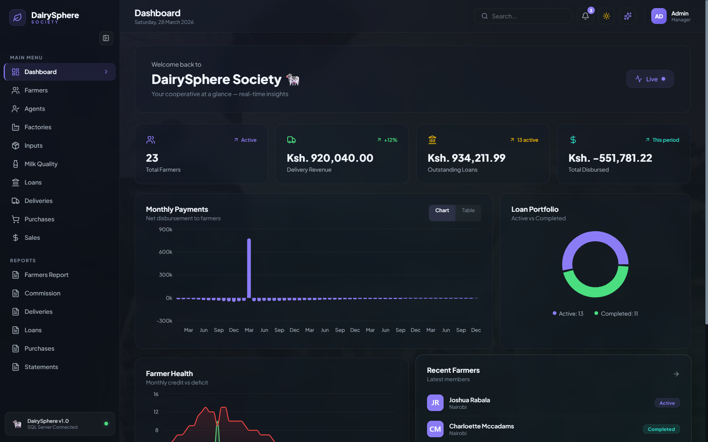
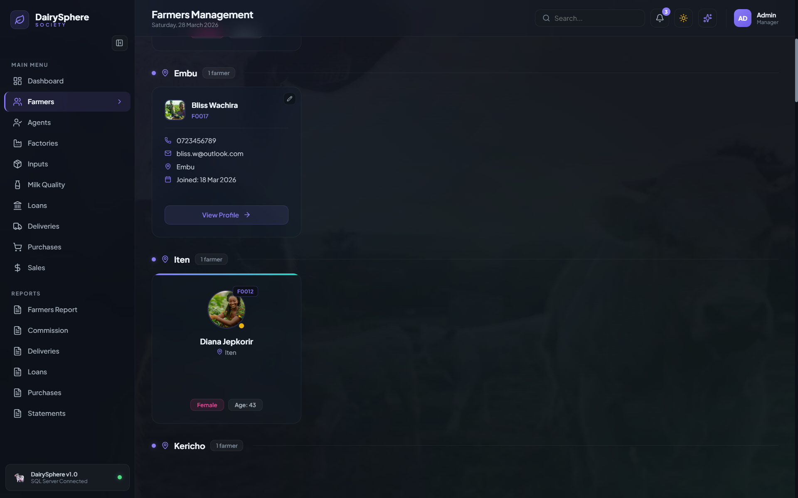
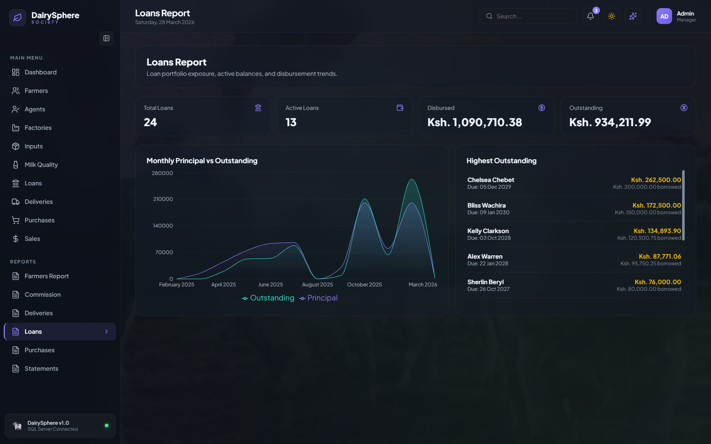

# DairyWeb

<p align="center">
	
</p>

<p align="center">
	
	
	
	
</p>

---

## Overview

**DairyWeb** is a full-stack dairy cooperative management system for **DairySphere Society**.

It combines:
- Fast CRUD workflows for daily operations (farmers, agents, factories, inputs, milk quality, loans, deliveries, purchases, and sales).
- Rich reporting views powered by SQL Server views and exposed via Express APIs.
- A modern dashboard and report UX with charts, grouped cards, profile photos, and animated transitions.

---

## Features

### Core Operations
- Farmer management with generated IDs, profile details, and profile photo upload support.
- Agent, factory, input, milk quality, loan, delivery, purchase, and sales management.
- Form-driven data entry with clean UI patterns and reusable form components.
- Calculated and derived values surfaced from SQL-backed logic (for example loan balances, deductions, and statement totals).

### Farmer Experience
- Grouped farmer profile cards by location.
- Search by name, ID, or location.
- Farmer profile pages and statement-specific views.
- Profile picture processing/storage through backend upload pipeline.

### Reports and Analytics
- Farmers List Report.
- Agents Commission Report.
- Deliveries Report.
- Loans Report.
- Input Purchases Report.
- Farmer Statements (monthly and lifetime financial position).

### Charts and Visualization
- Bar, line, area, and pie/donut charts using Recharts.
- KPI stat cards with currency-aware display formatting.
- Monthly trends and comparative views for deliveries, loans, commissions, purchases, and net payments.

### Motion and UX
- GSAP-powered transitions and reveal animations.
- Scroll-triggered visual effects in dashboard/report experiences.
- Glassmorphism-inspired UI cards and status indicators.
- "Live" dashboard context driven by fresh aggregated backend data on load.

---

## Tech Stack

### Frontend
- React + TypeScript (Vite)
- React Router
- Recharts
- GSAP
- Lucide Icons

### Backend
- Node.js + Express
- mssql
- Multer + Sharp (profile image upload and processing)
- dotenv + CORS

### Database
- Microsoft SQL Server
- SQL Server authentication
- ID generation, computed financial logic, and reporting views in database layer

---

## Project Structure

```text
DairyWeb/
|-- backend/
|   |-- routes/
|   |   |-- reports/
|   |-- uploads/
|   |   |-- farmers/
|   |-- db.js
|   |-- server.js
|-- frontend/
|   |-- src/
|   |   |-- components/
|   |   |-- pages/
|   |   |   |-- reports/
|   |   |-- api/
|   |   |-- styles/
|   |   |-- utils/
|   |-- index.html
|-- README.md
```

---

## Setup Instructions

### 1. Prerequisites

Install the following first:
- Node.js 18+ (Node.js 20+ recommended)
- npm
- Microsoft SQL Server (local instance)
- SQL Server Management Studio (recommended)

### 2. Clone and Install

```bash
git clone <your-repository-url>
cd DairyWeb
```

Install backend dependencies:

```bash
cd backend
npm install
```

Install frontend dependencies:

```bash
cd ../frontend
npm install
```

### 3. Configure Backend Environment

Create `backend/.env`:

```env
DB_USER=your_sql_user
DB_PASSWORD=your_sql_password
DB_SERVER=localhost
DB_DATABASE=DairySphereSociety
DB_PORT=1433
PORT=3001
```

Notes:
- Use `localhost\SQLEXPRESS` for `DB_SERVER` if your SQL Server runs as a named instance.
- Keep `PORT=3001` unless you also update the frontend API base URL.

### 4. Prepare SQL Server Database

1. Create a database named `DairySphereSociety`.
2. Create all required tables, relationships, computed/derived logic, and reporting views.
3. Ensure your SQL login has read/write permissions on the database.

The backend assumes these objects already exist and queries them directly.

### 5. Run the Backend API

From `backend/`:

```bash
node server.js
```

Expected API base URL:

```text
http://localhost:3001
```

### 6. Run the Frontend App

From `frontend/`:

```bash
npm run dev
```

Open the local Vite URL (usually `http://localhost:5173`).

### 7. Verify Connectivity

- Check backend health at `http://localhost:3001/`
- Open frontend and confirm dashboard cards/reports load without fetch errors
- Confirm image URLs resolve from `/uploads/farmers/...`

---

## API Overview

Base API URL used by frontend:

```text
http://localhost:3001/api
```

Main resource groups:
- `/api/farmers`
- `/api/agents`
- `/api/factories`
- `/api/inputs`
- `/api/milk-quality`
- `/api/loans`
- `/api/deliveries`
- `/api/input-purchases`
- `/api/sales`
- `/api/reports/*`

---

## DairySphereSociety Project Design Structure

```text
DATABASE: DairySphereSociety
|
|-- TABLES (9):
|   |-- Farmers         (F0001... + auto Age + profile pic)
|   |-- Agents          (A001...)
|   |-- Factories       (F001...)
|   |-- Inputs          (I001...)
|   |-- MilkQuality     (Q001... + Grade pricing)
|   |-- Loans           (L001... + FK Farmers)
|   |-- Deliveries      (D001... + BatchRef + auto Amount)
|   |-- InputPurchases  (P001... + auto PurchaseAmount)
|   \-- Sales           (S001... + auto 5% Commission)
|
|-- VIEWS (22):
|   |
|   |  -- Farmers Report
|   |-- vw_FarmersList
|   |
|   |  -- Agents Commission Report
|   |-- vw_AgentsCommissionMonthly
|   |-- vw_AgentsSummary
|   |-- vw_AgentSalesDetail
|   |
|   |  -- Deliveries Report
|   |-- vw_DeliveryDetails
|   |-- vw_FarmerMonthlyDeliveries
|   |-- vw_FarmerDeliveryOverview
|   |-- vw_MonthlyDeliveryTotals
|   |
|   |  -- Loans Report
|   |-- vw_LoanDetails
|   |-- vw_MonthlyLoanSummary
|   |-- vw_FarmerLoanOverview
|   |
|   |  -- Input Purchases Report
|   |-- vw_PurchaseDetails
|   |-- vw_FarmerMonthlyPurchases
|   |-- vw_MonthlyPurchaseTotals
|   |-- vw_FarmerPurchaseOverview
|   |-- vw_InputPopularity
|   |
|   |  -- Farmer Statements (FINAL REPORT)
|   |-- vw_StatementDeliveries              <- NEW
|   |-- vw_StatementCommissions             <- NEW
|   |-- vw_StatementLoanSchedule            <- NEW
|   |-- vw_StatementPurchases               <- NEW
|   |-- vw_FarmerMonthlyStatement           <- NEW (MASTER)
|   \-- vw_FarmerLifetimeEarnings           <- NEW
|
|-- QUERIES & REPORTS (6):
|   |
|   |-- REPORT 1: Farmers List
|   |   |-- Grouped by Location (ASC)
|   |   |-- Sorted by FarmerId (DESC)
|   |   \-- Frontend: Grouped cards with profile pics
|   |
|   |-- REPORT 2: Agents Commission Report
|   |   |-- Per agent, by Month-Year
|   |   |-- Page cycling per agent
|   |   |-- Charts: bar, line, pie
|   |   \-- GSAP animated transitions
|   |
|   |-- REPORT 3: Deliveries Report
|   |   |-- Per farmer, by Month-Year
|   |   |-- Quality grade breakdown (AA/A/B)
|   |   |-- Zero records hidden
|   |   \-- Expandable monthly sections
|   |
|   |-- REPORT 4: Loans Report
|   |   |-- Grouped by Month-Year borrowed
|   |   |-- 10% p.a. simple interest
|   |   |-- Status: Active / Completed
|   |   \-- Progress tracking per loan
|   |
|   |-- REPORT 5: Input Purchases Report
|   |   |-- Grouped by Month-Year
|   |   |-- Per farmer monthly totals
|   |   |-- Input popularity ranking
|   |   \-- Category breakdown
|   |
|   \-- REPORT 6: Farmer Statements (FINAL)
|       |-- Views:
|       |   |-- vw_StatementDeliveries
|       |   |-- vw_StatementCommissions
|       |   |-- vw_StatementLoanSchedule
|       |   |-- vw_StatementPurchases
|       |   |-- vw_FarmerMonthlyStatement (MASTER)
|       |   \-- vw_FarmerLifetimeEarnings
|       |-- Formula:
|       |   Net = Deliveries - Commission - Loans - Inputs
|       |-- Grouping: By Month-Year
|       |-- Rules:
|       |   |-- Missing transactions default to 0
|       |   |-- Negative net payments allowed
|       |   \-- Only months with transactions shown
|       |-- Status: Credit / Deficit / Zero
|       |-- Metrics:
|       |   |-- Monthly delivery amount
|       |   |-- Monthly commission deduction
|       |   |-- Monthly loan installment deduction
|       |   |-- Monthly inputs purchased
|       |   |-- Total deductions
|       |   |-- Net payment
|       |   |-- Lifetime earnings
|       |   |-- Avg monthly earning
|       |   |-- Best/worst month
|       |   |-- Months in credit vs deficit
|       |   \-- Society-wide summary
|       |-- Features:
|       |   |-- Individual farmer statement pages
|       |   |-- Farmer profile with photo
|       |   |-- Lifetime earnings summary card
|       |   |-- Monthly breakdown table
|       |   |-- Earnings vs deductions stacked bar chart
|       |   |-- Net payment trend line chart
|       |   |-- Deduction breakdown pie chart
|       |   |-- Credit vs deficit months indicator
|       |   |-- Society-wide dashboard
|       |   \-- Farmer ranking by lifetime earnings
|       \-- Frontend:
|           |-- GSAP animated profile card entrance
|           |-- GSAP counter animations for totals
|           |-- GSAP staggered chart bar animations
|           |-- GSAP scroll-triggered monthly reveals
|           |-- GSAP page transitions between farmers
|           |-- Color coded: Green (Credit) / Red (Deficit)
|           \-- Smooth monthly section expansions
|
|-- RELATIONSHIP MAP:
|   |-- Farmers ---- Loans          (1 -> Many)
|   |             |-- Deliveries     (1 -> Many)
|   |             |-- InputPurchases (1 -> Many)
|   |             \-- Sales          (1 -> Many)
|   |-- Agents ---- Sales            (1 -> Many)
|   |-- Factories -- Deliveries      (1 -> Many)
|   |-- MilkQuality - Deliveries     (1 -> Many)
|   \-- Inputs ----- InputPurchases  (1 -> Many)
|
|-- FRONTEND TECH:
|   |-- React + TypeScript (Vite)
|   |-- GSAP for animations
|   |   |-- Page transitions
|   |   |-- Number counters
|   |   |-- Chart animations
|   |   |-- Progress bars
|   |   |-- Scroll reveals
|   |   |-- Staggered entrances
|   |   \-- Color-coded status indicators
|   |-- Chart library: Recharts
|   \-- Currency: Ksh. X,XXX.XX
|
|-- BACKEND:
|   |-- Node.js + Express
|   |-- mssql package
|   \-- SQL Server Authentication
|
|-- DISPLAY STANDARDS:
|   |-- Currency:  Ksh. X,XXX.XX
|   |-- Dates:     dd MMM yyyy
|   |-- Litres:    X,XXX.XX L
|   |-- Percent:   XX.X%
|   |-- Periods:   X months
|   |-- Progress:  X/Y (with progress bar)
|   |-- Zeros:     Default 0 in statements
|   |-- Negative:  Red text with Ksh. -X,XXX.XX
|   \-- Positive:  Green text with Ksh. X,XXX.XX
|
\-- FILE STORAGE:
		\-- backend/uploads/ (farmer profile pictures)
```

---

## Screenshots

### Dashboard



### Farmers Management



### Loans Report



---

## Troubleshooting

### Frontend cannot reach API
- Confirm backend is running on port `3001`.
- Verify `frontend/src/api/index.ts` points to `http://localhost:3001/api`.

### SQL connection fails
- Verify SQL Server service is running.
- Confirm credentials and database name in `backend/.env`.
- Check if SQL Server accepts TCP on port `1433` for your instance.

### Images not loading
- Confirm files exist under `backend/uploads/farmers/`.
- Confirm backend static route `/uploads` is reachable.

---

## License

This project is licensed under a proprietary **All Rights Reserved** license.

- Copyright (c) 2026 Kimanzi-Collins.
- Copying, redistribution, or reuse of this codebase is **not permitted** without prior written permission from the owner.
- See the full legal terms in the `LICENSE` file.

---

## Sponsor

Support this project under **Kimanzi-Collins**:

GitHub Sponsors: https://github.com/sponsors/Kimanzi-Collins

